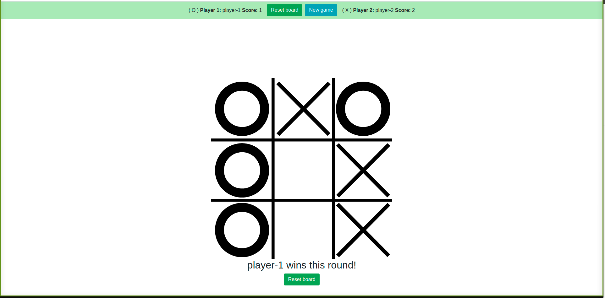

# TicTacToe Testing

This project was created to practice testing with jest on javascript.

## Built With

- HTML
- CSS
- JavaScript
- ESLint
- Prettier
- Jest

## Preview



## Live demo

- Watch the demo here: [live version](https://raw.githack.com/MiguelDP4/js-tic-tac-toe-testing/feature/dist/index.html)

## Test Results 

```

 PASS  src/tests/boardModule.test.js
  ✓ if user does not select a symbol, the default symbol is X (1 ms)
  ✓ if user selects a symbol, the symbol will be the one the user selected (1 ms)
  ✓ if user selects a symbol, the symbol will be the one the user selected
  ✓ If the user does not select a name, their name will be player<symbol>
  ✓ If the user does not select a name, their name will be player<symbol> (1 ms)
  ✓ If the user writes their name, their name will be the selected one
  ✓ The second player will have the opposite symbol the first player selected
  ✓ The second player will have the opposite symbol the first player selected
  ✓ checks if player won on position 1,2,3 
  ✓ checks if player won on position 4,5,6 
  ✓ checks if player won on position 7,8,9 
  ✓ checks if player won on position 0,3,6 
  ✓ checks if player won on position 1,4,7 
  ✓ checks if player won on position 2,5,8  (1 ms)
  ✓ checks if player won on position 0,4,8 
  ✓ checks if player won on position 6,4,2 
  ✓ checks if game is a draw
  ✓ checks if game is a not draw
  ✓ return true if position is not taken (1 ms)
  ✓ return false if position is taken

Test Suites: 1 passed, 1 total
Tests:       20 passed, 20 total
Snapshots:   0 total
Time:        1.012 s
Ran all test suites.

Watch Usage: Press w to show more.


```

## Authors

👤 **Miguel Dubois**

- Github: [@MiguelDP4](https://github.com/MiguelDP4)
- Twitter: [@Mike_DP4](https://twitter.com/Mike_DP4)
- LinkedIn [Miguel Dubois](https://www.linkedin.com/in/miguel-angel-dubois)

👤 **Ruben Paz Chuspe**

- Github: [@rubenpazch](https://github.com/rubenpazch)
- Linkedin: [rubenpch](https://www.linkedin.com/in/rubenpch/)
- Twitter: [chuspepaz](https://twitter.com/ChuspePaz)


## 🤝 Contributing

This project is for learning purposes only, we wont accept contributions, though suggestions are welcome.

## Show your support

Give a ⭐️ if you like this project!

## Acknowledgments

- We thank microverse for this learning opportunity.